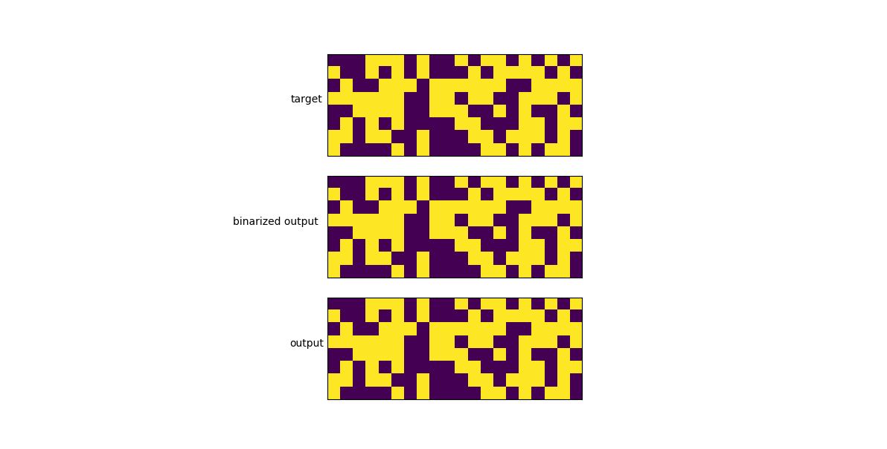

# ntm - Neural Turing Machine in pytorch

A [Neural Turing Machine](https://arxiv.org/abs/1410.5401) implementation in pytorch.

The goal was to implement a simple NTM with 1 read head and 1 write head, to reproduce the original paper's results.


## Copy task

The copy task tests whether NTM can store and recall a long sequence of arbitrary information. The network is presented with an input sequence of random binary vectors followed by a delimiter flag. The target sequence is a copy of the input sequence. No inputs are presented to the model while it receives the targets, to ensure that there is no assistance.

The model is trained on sequences of 1 to 20 8-bit random vectors. In less than 30k iterations, the model usually becomes really accurate.

Here is the net output compared to the target for a sequence of 20.



Here is the net output compared to the target for a sequence of 100. Note that the network was only trained with sequences of 20 or less.


## Usage

```
python copy_task.py
```

### References

1. Guy Zana, pytorch-ntm, https://github.com/loudinthecloud/pytorch-ntm/
